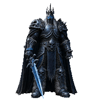
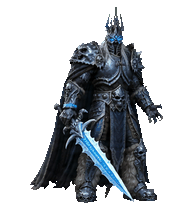
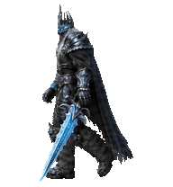
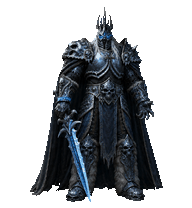
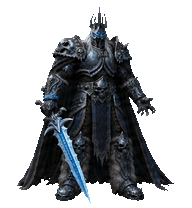
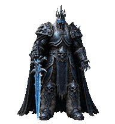
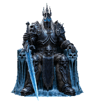
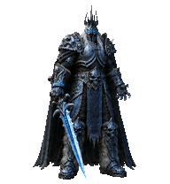
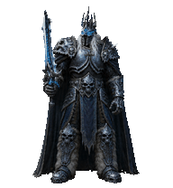
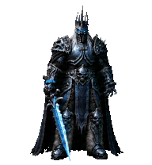

# The Lich King — Codex Pet

An unofficial, fan-made Codex v2 pet inspired by the Lich King from **World of Warcraft: Wrath of the Lich King**. It was made by a fan, for fans.

If the words **“I have gained power that my father could never have dreamed of”** mean something to you, this pet is for you.

The Lich King is the lord and master of the Scourge, ruling it telepathically from the Frozen Throne atop Icecrown Citadel. This pet keeps his cinematic silhouette: dark runic plate armor, a crown-like spiked helm, cold blue eyes, a heavy black-and-blue cloak, and an icy runeblade held only in his right hand.

## Animation showcase

| `idle` | `running-right` | `running-left` | `waving` | `jumping` | `failed` | `waiting` | `running` | `review` | `look-directions` |
| --- | --- | --- | --- | --- | --- | --- | --- | --- | --- |
|  |  |  |  |  |  |  |  |  |  |

## Install

Clone or download this repository, open its root directory, and run:

```bash
PET_INSTALL_DIR="${CODEX_HOME:-$HOME/.codex}/pets/lich-king"
if [ -e "$PET_INSTALL_DIR" ]; then
  printf 'Installation stopped: %s already exists. Back it up before replacing it.\n' "$PET_INSTALL_DIR"
else
  mkdir -p "$PET_INSTALL_DIR"
  cp pet.json spritesheet.webp "$PET_INSTALL_DIR/"
fi
```

Restart Codex if the custom-pet list does not refresh automatically.

## Package contents

- `pet.json` — Codex custom-pet metadata with package ID `lich-king`.
- `spritesheet.webp` — the installation-ready Codex v2 atlas.
- `animations/` — transparent GIF previews for every standard animation and the 16 look directions.

## Technical details

- Codex sprite format: v2
- Atlas layout: 8 columns × 11 rows
- Cell size: 192 × 208 pixels
- Atlas size: 1536 × 2288 pixels
- Background: transparent
- Standard animation rows: `idle`, `running-right`, `running-left`, `waving`, `jumping`, `failed`, `waiting`, `running`, and `review`
- Look-direction frames: 16

## Fan-project notice

This is an unofficial fan project. It is not affiliated with, endorsed by, or sponsored by Blizzard Entertainment. World of Warcraft, Wrath of the Lich King, the Lich King, and related characters and settings belong to their respective rights holders.
